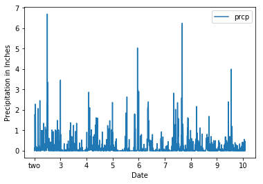
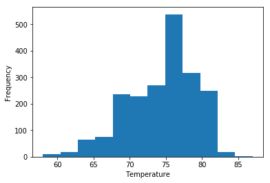
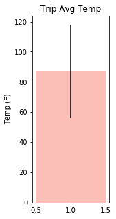

```python
#Import Dependencies
import sqlalchemy
from sqlalchemy.ext.automap import automap_base
from sqlalchemy.orm import Session
from sqlalchemy import create_engine, inspect
import pandas as pd
from datetime import datetime, timedelta
import matplotlib.pyplot as plt
```


```python
#Read in CSV Spreadsheets
hawaii_measurements = pd.read_csv("resources/clean_hawaii_measurements.csv")
hawaii_stations = pd.read_csv("resources/clean_hawaii_stations.csv")
```


```python
#Remove the extra index column(s)
hawaii_measurements = hawaii_measurements.rename(columns={"Unnamed: 0":"index"}).set_index('index')
hawaii_stations = hawaii_stations.rename(columns={"Unnamed: 0":"index"}).set_index('index')
```


```python
measurements_dates = hawaii_measurements['date']
measurements_dates[0]
```


    '2010-01-01'


```python
# View the dataframes
print(hawaii_measurements.head())
print(hawaii_stations.head())
```

               station        date  prcp  tobs
    index                                     
    0      USC00519397  2010-01-01  0.08    65
    1      USC00519397  2010-01-02  0.00    63
    2      USC00519397  2010-01-03  0.00    74
    3      USC00519397  2010-01-04  0.00    76
    5      USC00519397  2010-01-07  0.06    70
               station                                    name  latitude  \
    index                                                                  
    0      USC00519397                    WAIKIKI 717.2, HI US   21.2716   
    1      USC00513117                    KANEOHE 838.1, HI US   21.4234   
    2      USC00514830  KUALOA RANCH HEADQUARTERS 886.9, HI US   21.5213   
    3      USC00517948                       PEARL CITY, HI US   21.3934   
    4      USC00518838              UPPER WAHIAWA 874.3, HI US   21.4992   
    
           longitude  elevation  
    index                        
    0      -157.8168        3.0  
    1      -157.8015       14.6  
    2      -157.8374        7.0  
    3      -157.9751       11.9  
    4      -158.0111      306.6  


```python
# Connect to the SQL Engine
engine = create_engine("sqlite:///hawaii.sqlite")
conn = engine.connect()
```


```python
#Debug statement to clear the dataframes so I don't get errors when trying to run this script several times:
engine.execute("DELETE FROM hawaii_measurements;")
engine.execute("DELETE FROM hawaii_stations;")
```


    <sqlalchemy.engine.result.ResultProxy at 0x10a0b2ac8>


```python
#Push the dataframes to the database: 
hawaii_measurements.to_sql(name="hawaii_measurements", con=conn, if_exists='append')
hawaii_stations.to_sql(name="hawaii_stations", con=conn, if_exists='append')
```


```python
#Map the Classes from the database and pull out the keys:
Base = automap_base()
Base.prepare(engine, reflect=True)
```


```python
Base.classes.keys()
```


    ['hawaii_measurements', 'hawaii_stations']


```python
#Save the classes as objects to be used in the script:
Measurements = Base.classes.hawaii_measurements
Station = Base.classes.hawaii_stations
```


```python
#Create the Session object:
session = Session(engine)
```


```python
# Query the database for the chosen dates (12 months from the end of the database) and create add each row to a list:
data = session.query(Measurements.date, Measurements.prcp).filter(Measurements.date >= '2016-08-23').order_by(Measurements.date)
data_list = []
for row in data:
    data_list.append(row)
```


```python
# Use the list of rows to create a dataframe for the dates and preciptation value: 
date_prcp = pd.DataFrame(data= data_list)
date_prcp = date_prcp.sort_values("date", ascending=True)
date_prcp = date_prcp.set_index("date")
date_prcp.head()
```


<div>
<style scoped>
    .dataframe tbody tr th:only-of-type {
        vertical-align: middle;
    }

    .dataframe tbody tr th {
        vertical-align: top;
    }

    .dataframe thead th {
        text-align: right;
    }
</style>
<table border="1" class="dataframe">
  <thead>
    <tr style="text-align: right;">
      <th></th>
      <th>prcp</th>
    </tr>
    <tr>
      <th>date</th>
      <th></th>
    </tr>
  </thead>
  <tbody>
    <tr>
      <th>2016-08-23</th>
      <td>0.00</td>
    </tr>
    <tr>
      <th>2016-08-23</th>
      <td>0.15</td>
    </tr>
    <tr>
      <th>2016-08-23</th>
      <td>0.05</td>
    </tr>
    <tr>
      <th>2016-08-23</th>
      <td>0.02</td>
    </tr>
    <tr>
      <th>2016-08-23</th>
      <td>1.79</td>
    </tr>
  </tbody>
</table>
</div>


```python
#XTICK ATTEMPT WITH PLT.SUBPLOT
#x = date_prcp.index.tolist()
#y = date_prcp['prcp'].tolist()
#ax = plt.subplot(111)
#ax.bar(x, y)
#ax.xaxis_date()
#plt.show()
```


```python
# Plot the precipitation vs dates:
plt.figure(figsize=(5,3))
date_prcp.plot()
plt.xlabel("Date")
plt.ylabel("Precipitation in Inches")
locs, labels = plt.xticks([0,  250,  500,  750, 1000, 1250, 1500, 1750, 2000] , ["two", "3", "4", "5", "6", "7", "8","9","10",])
plt.show()
for label in labels:
    print(label)
```


    <matplotlib.figure.Figure at 0x10aaf6898>





    Text(0,0,'two')
    Text(250,0,'3')
    Text(500,0,'4')
    Text(750,0,'5')
    Text(1000,0,'6')
    Text(1250,0,'7')
    Text(1500,0,'8')
    Text(1750,0,'9')
    Text(2000,0,'10')


```python
# Read in the hawaii_measurements database and set it to a dataframe: 
measurements_df = pd.read_sql('SELECT * FROM hawaii_measurements', con=conn)
measurements_df.head()
```


<div>
<style scoped>
    .dataframe tbody tr th:only-of-type {
        vertical-align: middle;
    }

    .dataframe tbody tr th {
        vertical-align: top;
    }

    .dataframe thead th {
        text-align: right;
    }
</style>
<table border="1" class="dataframe">
  <thead>
    <tr style="text-align: right;">
      <th></th>
      <th>index</th>
      <th>station</th>
      <th>date</th>
      <th>prcp</th>
      <th>tobs</th>
    </tr>
  </thead>
  <tbody>
    <tr>
      <th>0</th>
      <td>0</td>
      <td>USC00519397</td>
      <td>2010-01-01</td>
      <td>0.08</td>
      <td>65</td>
    </tr>
    <tr>
      <th>1</th>
      <td>1</td>
      <td>USC00519397</td>
      <td>2010-01-02</td>
      <td>0.00</td>
      <td>63</td>
    </tr>
    <tr>
      <th>2</th>
      <td>2</td>
      <td>USC00519397</td>
      <td>2010-01-03</td>
      <td>0.00</td>
      <td>74</td>
    </tr>
    <tr>
      <th>3</th>
      <td>3</td>
      <td>USC00519397</td>
      <td>2010-01-04</td>
      <td>0.00</td>
      <td>76</td>
    </tr>
    <tr>
      <th>4</th>
      <td>5</td>
      <td>USC00519397</td>
      <td>2010-01-07</td>
      <td>0.06</td>
      <td>70</td>
    </tr>
  </tbody>
</table>
</div>


```python
#Count the number of stations:
number_of_stations = measurements_df['station'].nunique()
print(f"The number of stations is: {number_of_stations}")
```

    The number of stations is: 9


```python
#Find the number of stations' observations and the most station with the most observations:
print(measurements_df['station'].value_counts())
most_observed_station = measurements_df['station'].value_counts().index[0]
observations = measurements_df['station'].value_counts()[0]
print(f"The station with the most observations is stations number: {most_observed_station} with {observations} observations.")
```

    USC00519281    2772
    USC00513117    2696
    USC00519397    2685
    USC00519523    2572
    USC00516128    2484
    USC00514830    1937
    USC00511918    1932
    USC00517948     683
    USC00518838     342
    Name: station, dtype: int64
    The station with the most observations is stations number: USC00519281 with 2772 observations.


```python
#Create a dataframe with only the last 12 months of data:
last12months_df = pd.read_sql("SELECT * FROM hawaii_measurements WHERE date >= '2016-08-23'", con=conn)
last12months_df.head()
```


<div>
<style scoped>
    .dataframe tbody tr th:only-of-type {
        vertical-align: middle;
    }

    .dataframe tbody tr th {
        vertical-align: top;
    }

    .dataframe thead th {
        text-align: right;
    }
</style>
<table border="1" class="dataframe">
  <thead>
    <tr style="text-align: right;">
      <th></th>
      <th>index</th>
      <th>station</th>
      <th>date</th>
      <th>prcp</th>
      <th>tobs</th>
    </tr>
  </thead>
  <tbody>
    <tr>
      <th>0</th>
      <td>2363</td>
      <td>USC00519397</td>
      <td>2016-08-23</td>
      <td>0.00</td>
      <td>81</td>
    </tr>
    <tr>
      <th>1</th>
      <td>2364</td>
      <td>USC00519397</td>
      <td>2016-08-24</td>
      <td>0.08</td>
      <td>79</td>
    </tr>
    <tr>
      <th>2</th>
      <td>2365</td>
      <td>USC00519397</td>
      <td>2016-08-25</td>
      <td>0.08</td>
      <td>80</td>
    </tr>
    <tr>
      <th>3</th>
      <td>2366</td>
      <td>USC00519397</td>
      <td>2016-08-26</td>
      <td>0.00</td>
      <td>79</td>
    </tr>
    <tr>
      <th>4</th>
      <td>2367</td>
      <td>USC00519397</td>
      <td>2016-08-27</td>
      <td>0.00</td>
      <td>77</td>
    </tr>
  </tbody>
</table>
</div>


```python
# Create a graph of the frequency of each temperature:
plt.hist(last12months_df['tobs'], 12)
plt.xlabel("Temperature (F)")
plt.ylabel("Frequency")
plt.show()
```





```python
#Create a function that finds the min, max, and mean temps for a given date range and make a graph:
def calc_temps (start_date, end_date):
    dataframe = pd.read_sql(f"SELECT * FROM hawaii_measurements WHERE (date >= '{start_date}' AND date <= '{end_date}')", con=conn)
    min_temp = dataframe['tobs'].min()
    max_temp = dataframe['tobs'].max()
    mean_temp = dataframe['tobs'].mean()
    
    print(f"The minimum temperature for your date range is: {min_temp}")
    print(f"The maximum temperature for your date range is: {max_temp}")
    print(f"The average temperature for your date range is: {mean_temp}")
    
    plt.figure(figsize=(2,5))
    plt.bar(1, max_temp, width=1, yerr=(max_temp - min_temp), color="salmon", alpha=.5)
    plt.ylabel("Temp (F)")
    plt.title("Trip Avg Temp")
    plt.show()
```


```python
#Test the function:
calc_temps("2010-01-01", "2010-12-30")
```

    The minimum temperature for your date range is: 56
    The maximum temperature for your date range is: 87
    The average temperature for your date range is: 72.50074794315633




